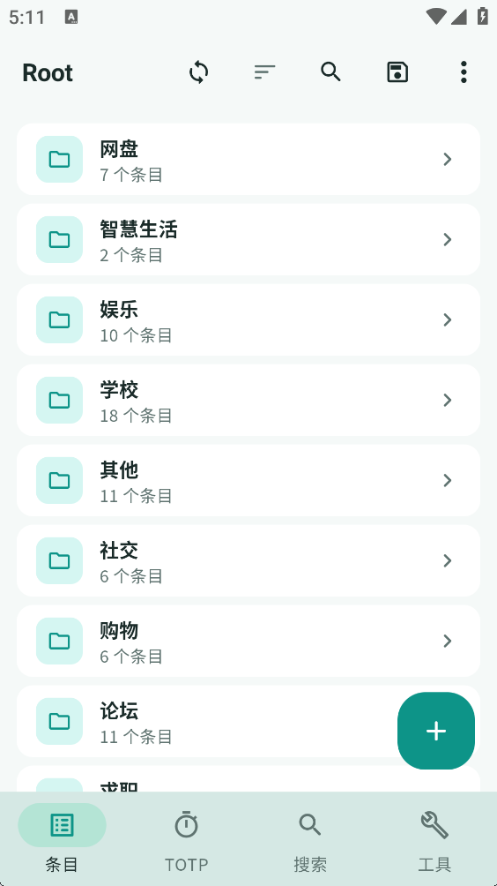
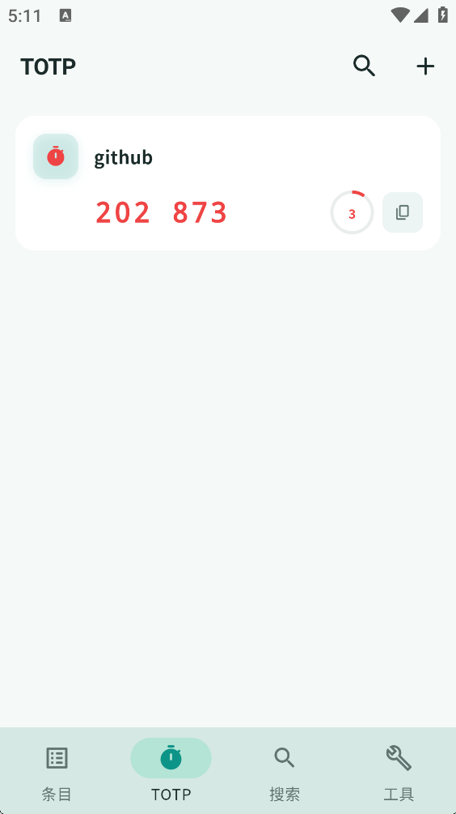

**中文** | [English](README_EN.md)

# KeeVault

基于 Flutter 的跨平台 KeePass 兼容密码管理器。

<p align="center">
  
</p>
<p align="center">
  
  
</p>

## 功能

- WebDAV 云同步、TOTP、指纹解锁、Key File 双因素认证
- CSV / KDBX 导入导出，兼容 Chrome、1Password、LastPass、Bitwarden 等
- 文件附件、条目历史、自定义字段、标签与分组
- 密码生成器、自动锁定/保存、剪贴板自动清除、过期提醒
- 系统托盘、键盘快捷键、亮暗主题、中英文

## 安装

从 [Releases](https://github.com/lyj404/keevault/releases) 下载对应平台安装包。

| 平台 | 说明 |
|------|------|
| Windows | 下载 `KeeVault-*-windows-x64.zip`，解压运行 `keevault.exe` |
| Debian / Ubuntu | `sudo apt install ./keevault_*_amd64.deb` |
| Arch Linux | `yay -S keevault-bin` 或 `paru -S keevault-bin` |
| Android | 下载对应架构 APK（`arm64-v8a` / `armeabi-v7a` / `x86_64`）安装 |

## 从源码构建

需要 Flutter / Dart SDK >= 3.12.0

```bash
git clone https://github.com/lyj404/keevault
cd keevault
flutter pub get
flutter run -d windows    # 或 linux / android
```

## 技术栈

Flutter · Riverpod · go_router · kpasslib · WebDAV · local_auth

## 友链

- [LINUX DO 社区](https://linux.do/)

## 开源协议

[Apache License 2.0](LICENSE)
