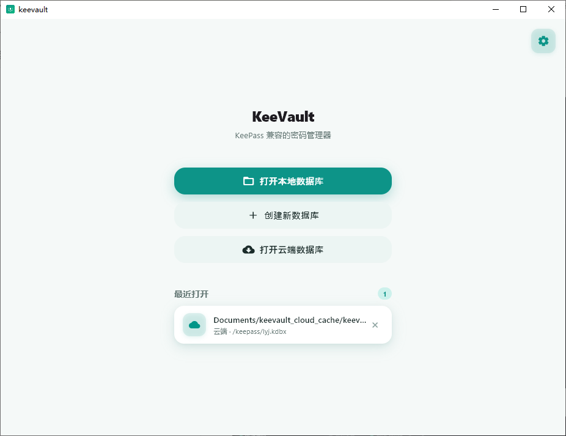

**中文** | [English](README_EN.md)

# KeeVault

基于 Flutter 构建的跨平台 KeePass 兼容密码管理器。



## 功能特性

### 核心功能
- **WebDAV 云端同步** - 通过 WebDAV 协议同步数据库，支持冲突检测与自动处理
- **TOTP 支持** - 一次性动态验证码生成，兼容 KeePassXC 存储格式，支持二维码扫描配置
- **指纹解锁** - Android 端支持使用指纹/面部识别解锁数据库
- **Key File 认证** - 支持使用密钥文件作为第二层验证，密码 + 文件双因素解锁
- **CSV 导入/导出** - 支持从 Chrome、1Password、LastPass、Bitwarden 等导入密码
- **KDBX 导出** - 导出完整的 KeePass 数据库文件
- **文件附件** - 支持在条目中附加文件（SSH 密钥、证书、恢复密钥等）
- **条目历史查看** - 查看条目的历史版本记录，支持回溯和恢复旧版本

### 安全与管理
- **数据库备份** - 自动备份、手动备份、可配置保留数量，支持从备份恢复
- **密码生成器** - 可自定义长度、字符类型、特殊符号的强密码生成
- **密码强度指示** - 可视化密码强度评估
- **修改主密码** - 支持修改数据库主密码
- **回收站** - 软删除条目，支持恢复
- **自动锁定** - 可配置闲置时间自动锁定数据库（1-60 分钟）
- **自动保存** - 可配置闲置时间自动保存数据库（15-300 秒）
- **剪贴板自动清除** - 复制密码后 30 秒自动清除剪贴板
- **密码过期提醒** - 桌面通知提醒即将过期的密码（1-30 天）

### 组织与搜索
- **标签系统** - 为条目标签分类，支持按标签筛选
- **批量操作** - 批量删除、移动、编辑标签
- **自定义字段** - 为条目添加自定义字段，支持字段保护
- **分组管理** - 支持子分组路径，移动条目到不同分组
- **模糊搜索** - 快速搜索所有条目，支持防抖输入
- **条目排序** - 按标题、创建时间、修改时间、过期时间排序

### 桌面功能
- **系统托盘** - 最小化到系统托盘（Windows/Linux）
- **键盘快捷键** - Ctrl+F 搜索、Ctrl+S 保存、Ctrl+B 复制用户名、Ctrl+C 复制密码、Ctrl+U 复制网址、Ctrl+T 复制 TOTP
- **窗口关闭行为** - 可配置关闭窗口时的操作（最小化到托盘、退出、每次询问）

### 界面与体验
- **跨平台** - 支持 Android、Linux、Windows
- **主题切换** - 亮色/暗色/跟随系统主题
- **多语言** - 中文/英文/跟随系统语言
- **响应式布局** - 宽屏/窄屏自适应布局
- **面包屑导航** - 层级分组导航

## CSV 导入格式说明

支持自动识别多种常见密码管理器的 CSV 格式，无需固定模板：

### 支持的列名（不区分大小写）

| 字段 | 支持的列名 |
|------|-----------|
| 标题 | `Title`, `Name`, `Entry Name` |
| 用户名 | `Username`, `User`, `Login`, `Login_Username` |
| 密码 | `Password`, `Pass`, `Passwd`, `Login_Password` |
| 网址 | `URL`, `URI`, `Website`, `Web Site`, `Login_URI` |
| 备注 | `Notes`, `Note`, `Extra`, `Comments`, `Comment` |
| 分组 | `Group`, `Grouping`, `Folder`, `Folders`, `Path` |
| TOTP | `TOTP`, `OTPAuth`, `Login_TOTP`, `OTP` |

### 支持的密码管理器格式

**Chrome / Google 密码管理器**
```csv
name,url,username,password
```

**1Password**
```csv
Title,Username,Password,URL,Notes
```

**LastPass**
```csv
url,username,password,totp,extra,name,grouping,fav
```

**Bitwarden**
```csv
folder,favorite,type,name,notes,fields,reprompt,login_uri,login_username,login_password,login_totp
```

**KeePass**
```csv
Group,Title,Username,Password,URL,Notes
```

### 说明

- 分隔符自动检测：支持逗号 (`,`)、分号 (`;`)、制表符
- 自动跳过 UTF-8 BOM
- 自动识别标题行
- 未识别的列会作为自定义字段导入
- 支持子分组路径（如 `Email/Work`）

### 导出格式

- **CSV 导出**：使用 KeePass 兼容格式（`Group,Title,Username,Password,URL,Notes`）
- **KDBX 导出**：导出完整的 KeePass 数据库文件

---

从 [Releases](https://github.com/lyj404/keevault/releases) 页面下载对应平台的安装包。

### Windows

下载 `KeeVault-*-windows-x64.zip`，解压后运行 `keevault.exe`。

### Debian / Ubuntu

下载 `.deb` 安装包，使用 `apt` 安装：

```bash
sudo apt install ./keevault_*_amd64.deb
```

### Arch Linux

通过 AUR 安装：

```bash
# 使用 yay
yay -S keevault-bin

# 或使用 paru
paru -S keevault-bin
```

### Android

下载对应架构的 APK 文件（`arm64-v8a`、`armeabi-v7a` 或 `x86_64`），安装到设备上。

## 从源码构建

### 环境要求

- Flutter SDK >= 3.12.0
- Dart SDK >= 3.12.0

```bash
git clone https://github.com/lyj404/keevault
cd keevault
flutter pub get
flutter run -d windows    # Windows
flutter run -d linux      # Linux
flutter run -d android    # Android
```

## 技术栈

- **框架**: Flutter
- **状态管理**: Riverpod
- **路由**: go_router
- **KDBX 解析**: kpasslib
- **本地存储**: flutter_secure_storage
- **生物识别**: local_auth
- **文件选择**: file_picker
- **CSV 解析**: csv
- **OTP 生成**: otp
- **二维码扫描**: mobile_scanner
- **系统托盘**: system_tray / dart_xdg_status_notifier_item
- **窗口管理**: window_manager
- **WebDAV 同步**: webdav_client
- **本地通知**: flutter_local_notifications
- **Windows 原生通知**: win32 / ffi
- **日志**: logger

## 友链

- [LINUX DO 社区](https://linux.do/)

## 开源协议

本项目基于 Apache License 2.0 开源 - 详见 [LICENSE](LICENSE) 文件。
