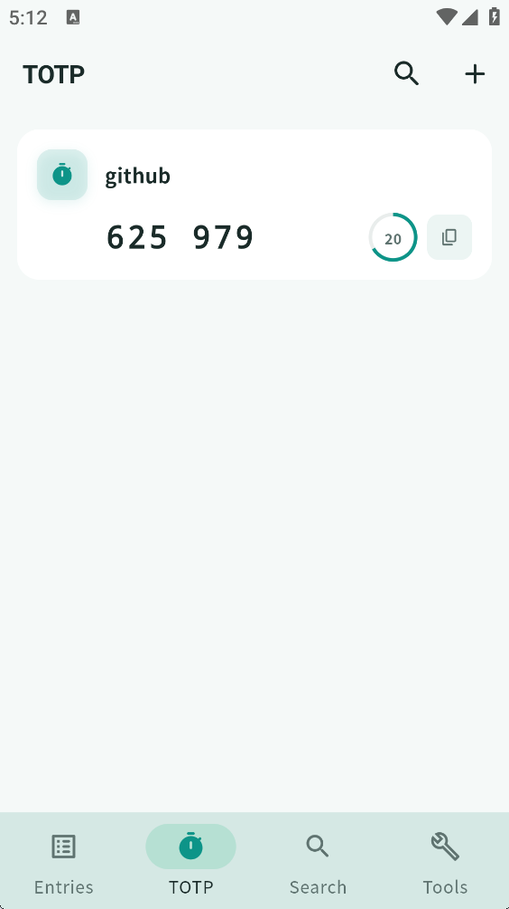

[中文](README.md) | **English**

# KeeVault

A cross-platform KeePass-compatible password manager built with Flutter.

<p align="center">
  
</p>
<p align="center">
  
  
</p>

## Features

- WebDAV cloud sync, TOTP, fingerprint unlock, key file dual-factor auth
- CSV / KDBX import & export (Chrome, 1Password, LastPass, Bitwarden, etc.)
- File attachments, entry history, custom fields, tags & groups
- Password generator, auto-lock/save, clipboard auto-clear, expiry reminders
- System tray, keyboard shortcuts, light/dark theme, Chinese/English

## Install

Download from [Releases](https://github.com/lyj404/keevault/releases).

| Platform | Notes |
|----------|-------|
| Windows | Download `KeeVault-*-windows-x64.zip`, extract and run `keevault.exe` |
| Debian / Ubuntu | `sudo apt install ./keevault_*_amd64.deb` |
| Arch Linux | `yay -S keevault-bin` or `paru -S keevault-bin` |
| Android | Install the APK for your arch (`arm64-v8a` / `armeabi-v7a` / `x86_64`) |

## Build from Source

Requires Flutter / Dart SDK >= 3.12.0

```bash
git clone https://github.com/lyj404/keevault
cd keevault
flutter pub get
flutter run -d windows    # or linux / android
```

## Tech Stack

Flutter · Riverpod · go_router · kpasslib · WebDAV · local_auth

## Friendly Links

- [LINUX DO Community](https://linux.do/)

## License

[Apache License 2.0](LICENSE)
