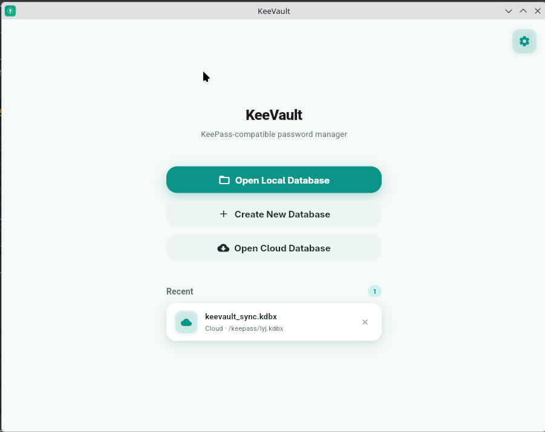

[中文](README.md) | **English**

# KeeVault

A cross-platform KeePass-compatible password manager built with Flutter.



## Features

- **WebDAV Cloud Sync** - Sync database via WebDAV protocol with conflict detection and automatic resolution
- **TOTP Support** - Generate one-time passwords, KeePassXC storage format compatible
- **Fingerprint Unlock** - Android support for unlocking databases with fingerprint/face recognition
- **Key File Authentication** - Support key file as a second authentication factor for dual-factor unlock
- **CSV Import/Export** - Import passwords from Chrome, 1Password, LastPass, Bitwarden, etc.
- **File Attachments** - Attach files to entries (SSH keys, certificates, recovery keys)
- **Entry History** - View historical versions of entries with rollback and restoration support
- **Cross-Platform** - Supports Android, Linux, Windows

## CSV Import Format

Supports automatic detection of common password manager CSV formats - no fixed template required:

### Supported Column Names (Case-Insensitive)

| Field | Supported Column Names |
|-------|----------------------|
| Title | `Title`, `Name`, `Entry Name` |
| Username | `Username`, `User`, `Login`, `Login_Username` |
| Password | `Password`, `Pass`, `Passwd`, `Login_Password` |
| URL | `URL`, `URI`, `Website`, `Web Site`, `Login_URI` |
| Notes | `Notes`, `Note`, `Extra`, `Comments`, `Comment` |
| Group | `Group`, `Grouping`, `Folder`, `Folders`, `Path` |
| TOTP | `TOTP`, `OTPAuth`, `Login_TOTP`, `OTP` |

### Supported Password Manager Formats

**Chrome / Google Password Manager**
```csv
name,url,username,password
```

**1Password**
```csv
Title,Username,Password,URL,Notes
```

**LastPass**
```csv
url,username,password,totp,extra,name,grouping,fav
```

**Bitwarden**
```csv
folder,favorite,type,name,notes,fields,reprompt,login_uri,login_username,login_password,login_totp
```

**KeePass**
```csv
Group,Title,Username,Password,URL,Notes
```

### Notes

- Delimiter auto-detection: comma (`,`), semicolon (`;`), and tab supported
- Automatic UTF-8 BOM stripping
- Automatic header row detection
- Unrecognized columns are imported as custom fields
- Supports nested group paths (e.g., `Email/Work`)

### Export Formats

- **CSV Export**: KeePass-compatible format (`Group,Title,Username,Password,URL,Notes`)
- **KDBX Export**: Full KeePass database file export

---

Download the corresponding platform installer from the [Releases](https://github.com/lyj404/keevault/releases) page.

### Windows

Download `KeeVault-*-windows-x64.zip`, extract and run `keevault.exe`.

### Debian / Ubuntu

Download the `.deb` package and install with `apt`:

```bash
sudo apt install ./keevault_*_amd64.deb
```

### Arch Linux

Install from AUR:

```bash
# Using yay
yay -S keevault-bin

# Or using paru
paru -S keevault-bin
```

### Android

Download the APK file for your device architecture (`arm64-v8a`, `armeabi-v7a`, or `x86_64`) and install it.

## Build from Source

### Prerequisites

- Flutter SDK >= 3.12.0
- Dart SDK >= 3.12.0

```bash
git clone https://github.com/lyj404/keevault
cd keevault
flutter pub get
flutter run -d windows    # Windows
flutter run -d linux      # Linux
flutter run -d android    # Android
```

## Tech Stack

- **Framework**: Flutter
- **State Management**: Riverpod
- **Routing**: go_router
- **KDBX Parsing**: kpasslib
- **Local Storage**: flutter_secure_storage
- **Biometric Auth**: local_auth
- **File Picking**: file_picker
- **CSV Parsing**: csv
- **System Tray**: system_tray / dart_xdg_status_notifier_item
- **Window Management**: window_manager
- **WebDAV Sync**: webdav_client
- **Logging**: logger

## Friendly Links

- [LINUX DO Community](https://linux.do/)

## License

This project is licensed under the Apache License 2.0 - see the [LICENSE](LICENSE) file for details.
